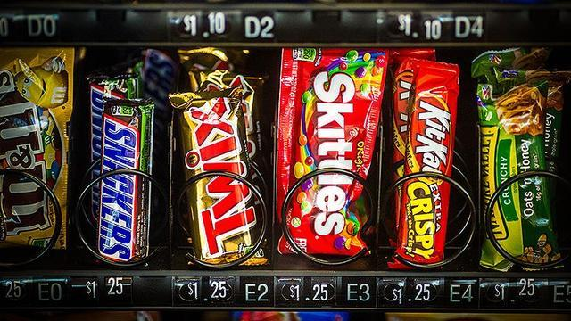

# JunkFood Machine



O objetivo dessa atividade é implementar uma classe responsável por uma máquina de vender JunkFood. Na máquina existem várias espirais. Uma espiral contém uma certa quantidade de produtos do mesmo tipo e mesmo preço. O usuário coloca o dinheiro, compra o produto e recebe o troco.

# Funcionalidades
Seu sistema deverá ser capaz de:

- <b>[3.0 P] Iniciando a máquina</b>
    - Iniciar a máquina definindo o número de espirais e a quantidade máxima de produtos em uma espiral.
        - Se já houver uma máquina, então apague tudo e inicie uma nova máquina.
    - Mostrar o conteúdo de cada espiral
        - indice, nome do produto, quantidade de produtos e preço.
        - Coloque um “-“ no nome do produto para informar que não há produto definido.
- <b>[2.0 P] Algo pra comer</b>
    - Definir quais produtos há em cada espiral passando as informações do produto.
- <b>[2.0 P] Resetar uma espiral</b>
    - Limpar todas as informações da espiral voltando ao seu estado original.
    - Tratar os erros de indice inválido e máximo de produtos estourado.
- <b>[1.0 P] Dinheiro vai</b>
    - Inserir dinheiro na espiral.
        - Abstraia como o dinheiro vai. Crédito, débito, bitcoin, cédula nova ou velha, ficha de fliperama. Não importa.
        - Receber o dinheiro do usuário e vá adicionando ao saldo.
        - Alterar o mostrar máquina para mostrar o saldo também.
- <b>[2.0 P] Comida vem, Dinheiro vem, Erros também</b>
    - Permitir que o cliente possa comprar um produto de uma espiral.
        - Verificar se existe o produto e se o valor do pagamento é suficiente.
        - Tratar todos esses erros.
        - Mostrar o nome do produto que ele pediu.
- Quando o cliente pedir o troco, mostre o quanto ele tinha de saldo e zere o saldo.

# Exemplos

```
#__begin__
#######################################
# Iniciando a máquina
#######################################

# init _espirais _max_produtos
$init 3 5
$show
saldo: 0.00
0 [   empty : 0 U : 0.00 RS]
1 [   empty : 0 U : 0.00 RS]
2 [   empty : 0 U : 0.00 RS]

#######################################
# Algo pra comer
#######################################

# set _ind _nome _qtd _valor 
$set 2 todinho 3 2.50
$show
saldo: 0.00
0 [   empty : 0 U : 0.00 RS]
1 [   empty : 0 U : 0.00 RS]
2 [ todinho : 3 U : 2.50 RS]

$set 0 tampico 1 1.50
$set 1 xaverde 3 5.00
$show   
saldo: 0.00
0 [ tampico : 1 U : 1.50 RS]
1 [ xaverde : 3 U : 5.00 RS]
2 [ todinho : 3 U : 2.50 RS]

#######################################
# Limpando e Tratando erros de insercao
#######################################

# limpar _ind
$limpar 2
$show
saldo: 0.00
0 [ tampico : 1 U : 1.50 RS]
1 [ xaverde : 3 U : 5.00 RS]
2 [   empty : 0 U : 0.00 RS]
$set 4 ovo 2 4.30
fail: indice nao existe
$set 0 farofa 50 3.00
fail: limite excedido

#######################################
# Dinheiro vai
#######################################

# inserindo dinheiro
# dinheiro _valor
$dinheiro 5
$dinheiro 4
$show   
saldo: 9.00
0 [ tampico : 1 U : 1.50 RS]
1 [ xaverde : 3 U : 5.00 RS]
2 [   empty : 0 U : 0.00 RS]

#######################################
# Comida vem, Dinheiro vem, Erros também
#######################################

$troco
voce recebeu 9.00 RS
$show
saldo: 0.00
0 [ tampico : 1 U : 1.50 RS]
1 [ xaverde : 3 U : 5.00 RS]
2 [   empty : 0 U : 0.00 RS]
$dinheiro 8

# comprar _ind
$comprar 1
voce comprou um xaverde
$comprar 1
fail: saldo insuficiente
$comprar 0
voce comprou um tampico
$show
saldo: 1.50
0 [ tampico : 0 U : 1.50 RS]
1 [ xaverde : 2 U : 5.00 RS]
2 [   empty : 0 U : 0.00 RS]
$comprar 0
fail: espiral sem produtos
$comprar 4
fail: indice nao existe
$troco
voce recebeu 1.50 RS
$end
#__end__

```